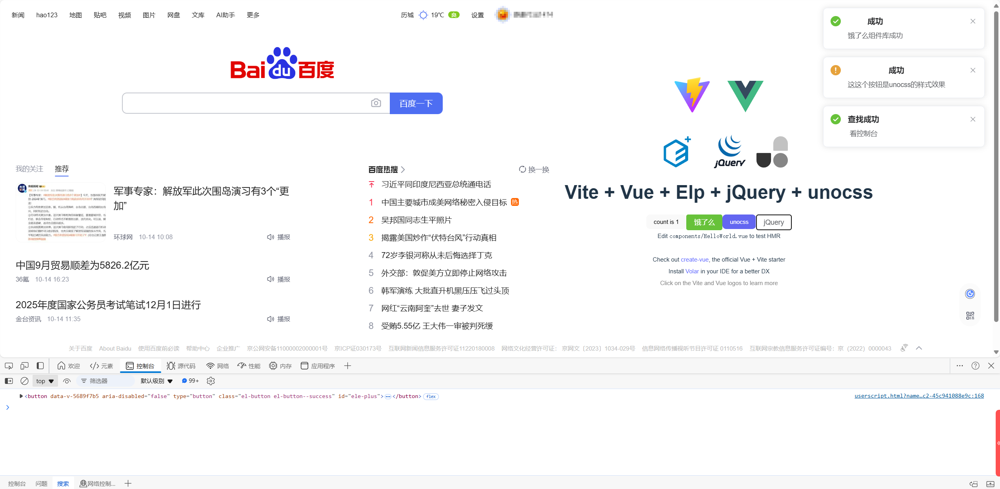

一个 vite 插件，用来辅助开发 [Tampermonkey](https://www.tampermonkey.net/), [Violentmonkey](https://violentmonkey.github.io/), [Greasemonkey](https://www.greasespot.net/), [ScriptCat](https://docs.scriptcat.org/) 等脚本引擎 的脚本

# 主要特性
* 支持 Tampermonkey、Violentmonkey、Greasemonkey、ScriptCat 等脚本引擎的辅助开发
* 打包自动注入脚本配置头部注释
* 当第一次启动或脚本配置注释改变时自动在默认浏览器打开脚本安装
* 利用 @require 配置库的 CDN 的方案，减少构建脚本大小
* 利用 @resource 配置外部资源 CDN 的方案，额外减少构建脚本大小
* 通过 ESM 导入的方式使用 GM_api，附带类型提示
* 智能收集使用到的 GM_api，自动配置 @grant 注释
* 支持 top level await 和单文件下的 dynamic import
* 预览模式下自动打开浏览器安装构建好的脚本
* 完全的 Typescript 和 Vite 的开发体验，比如模块热替换，秒启动
# 介绍
从[原项目](https://github.com/lisonge/vite-plugin-monkey)中扩展得到的,添加了常用的工具和库. 自己也会把用到的一些工具加进来,方便新脚本开发时的快速启动.

原项目wiki: [https://github.com/lisonge/vite-plugin-monkey/blob/main/README_zh.md](https://github.com/lisonge/vite-plugin-monkey/blob/main/README_zh.md)

扩展后使用到的技术:

ts

vue3

jQuery

Element-Plus

unocss

# 启动和发布
## 启动

```
// 安装依赖
pnpm i
// 启动
pnpm run dev
```
启动项目,并且会自动打开浏览器安装脚本
## 发布
先编译项目
```
pnpm run build
```
会在**dist**中生成对应的脚本
> 如果手动指定了@require的版本,在打包后需要把最后一行中的对应的版本删除:
> ```vue
>/// 删除后面的@版本号
>})(Vue, jQuery@3.7.1, ElementPlus@2.8.5);
>/// 变成这样的
>})(Vue, jQuery, ElementPlus);
>```
### 使用
直接把dist中的js复制到油猴扩展里面就行
### 发布到greasyfork
项目使用的库里面有个https://cdn.jsdelivr.net/npm/vue-demi@latest/lib/index.iife.js

它并不在greasyfork的白名单里

需要把他替换为https://cdn.jsdelivr.net/npm/vue-demi@0.14.10/lib/index.iife.min.js
```
// ==UserScript==
...
// @description  油猴快速开发
...
- // @require      https://cdn.jsdelivr.net/npm/vue-demi@latest/lib/index.iife.js
+ // @require      https://cdn.jsdelivr.net/npm/vue-demi@0.14.10/lib/index.iife.min.js
...
// @grant        GM_getResourceText
// ==/UserScript==
```
> 查看引入的包在不在白名单:
> [https://greasyfork.org/zh-CN/help/cdns](https://greasyfork.org/zh-CN/help/cdns)
### 编译失败
由于使用了ts,编译时会进行类型检查,随着代码变多,

或者在window下随意的挂载属性,变量没指定类型,脚本的报错/标红也会变多

但这些运行时都没有问题,一打包就会被终止.

解决方法:
在报错文件中的script下方添加一行// @ts-nocheck,跳过这个文件的检查
```vue
<script setup lang="ts">
// @ts-nocheck
...忽略代码...
</script>
```

# 用到的命令

### 添加自动导入
安装命令
```
pnpm add -D unplugin-auto-import
```
配置参考: https://github.com/unplugin/unplugin-auto-import
### 添加element-plus
```
pnpm install element-plus
```
添加对应的@require
> 我也不知道为啥这样写,参考: https://github.com/lisonge/vite-plugin-monkey/issues/5

```
// vite.config.ts
//monkey.build属性
externalGlobals:  [
          [
            'vue',
            cdn
                .jsdelivr('Vue', 'dist/vue.global.prod.js')
                .concat(
                    cdn.jsdelivr('', 'lib/index.iife.js')[1]('latest', 'vue-demi'),
                )
                .concat(util.dataUrl(';window.Vue=Vue;')),
          ],
          [
            'element-plus',
            cdn.jsdelivr('ElementPlus@2.8.5', 'dist/index.full.min.js'),
          ],
        ]
```

main.js里使用element
```
...省略...
import ElementPlus from 'element-plus';
import 'element-plus/dist/index.css';
...省略...
app.use(ElementPlus);
```
### 添加unocss
参考
https://unocss.nodejs.cn/integrations/vite

https://unocss.net/presets/rem-to-px


安装
```
pnpm add -D unocss
```

安装像素转换
```
pnpm add -D @unocss/preset-rem-to-px
```
main.ts中引入
```
import 'virtual:uno.css'
```

### 添加jQuery
> jq的变量名和模板的$冲突,所以先设置模板的$为别的,看原wiki中的clientAlias属性

添加jq
```
pnpm add jquery
pnpm add -D @types/jquery
```

添加对应的@require
```
//externalGlobals再加一条
  [
            'jquery',
            cdn.jsdelivr('jQuery@3.7.1','dist/jquery.min.js')
        ]
```
